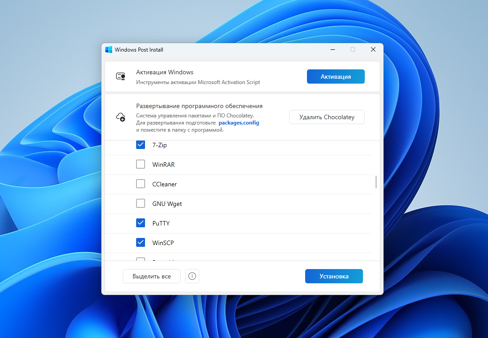

# Windows Post Install

 <!-- Замените на фактическую ссылку на изображение, если доступна -->

**Windows Post Install** — это приложение для активации и пакетного развертывания программного обеспечения, которое упрощает настройку новой системы. Оно позволяет пользователям устанавливать необходимые программы и настраивать окружение сразу после установки Windows.

В приложении используется **Chocolatey** — менеджер пакетов для Windows, который автоматизирует загрузку и установку программ. Пользователи могут выбрать несколько программ для одновременной установки, что значительно ускоряет процесс настройки и избавляет от необходимости вручную искать установочные файлы.

## Возможности

- Активация Windows и Office средствами Microsoft Activation Script.  
  Используется онлайн скрипт massgrave — [Исходный код на GitHub](https://github.com/massgravel/Microsoft-Activation-Scripts).

- Пакетное развертывание программного обеспечения при помощи утилиты Chocolatey.

  Поддерживаются файлы `packages.config`, которые генерируются в разделе [Packages](https://community.chocolatey.org/packages) на сайте Chocolatey. Выберите на этой странице нужные вам приложения, затем нажмите:

  **Builder -> Generate Script** и, не изменяя настройки, нажмите **Next**. На последней странице скачайте файл `packages.config`. После генерации поместите файл в директорию приложения.

  Для удобства в файл конфигурации можно добавить атрибуты `name`, содержащие название приложения или пакета для установки.


## Сборка

Установите .NET SDK и произведите сборку:
```
dotnet build
```


## Системные требования

- Операционная система: Windows 10 или выше
- .NET Framework: 4.5 или выше


## Лицензия

Этот проект лицензируется в соответствии с MIT License. Пожалуйста, ознакомьтесь с файлом LICENSE для получения подробной информации.
